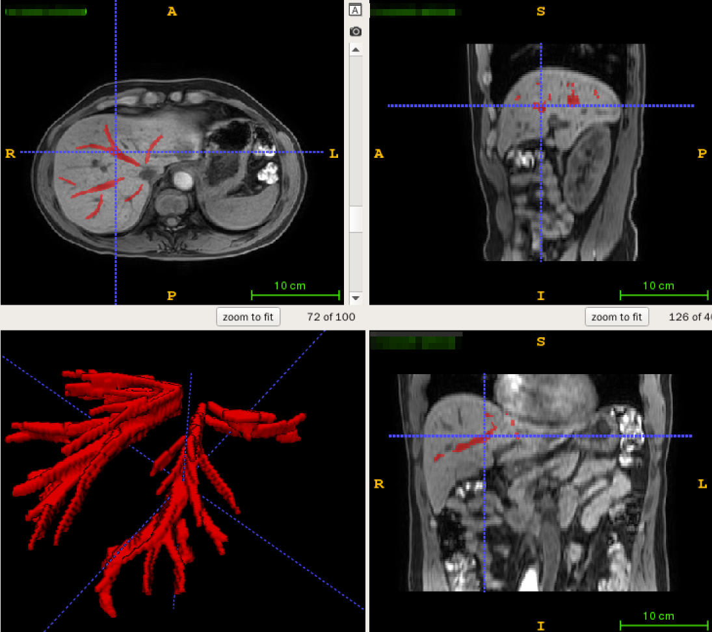
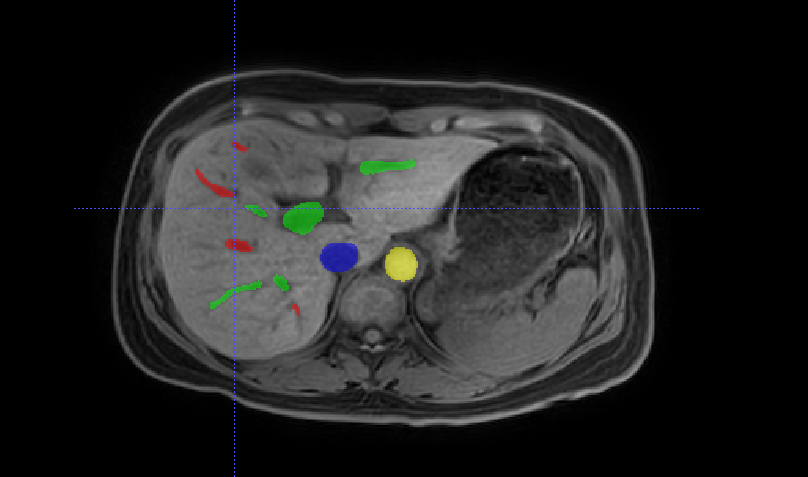
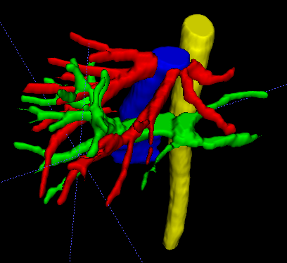

# Segmentation Network (2.5D)

The model is based on UNet with modifications of the dimension with shape of h x w x 5.

## Dependencies

Ubuntu 20.04.3, python 3.6, CUDA 11.0, anaconda (4.10.1),nibabel (3.2.1), SimpleITK (2.1.1), numpy (1.19.5), scikit-image (0.17.2), scipy (1.5.2), pytorch (1.7.1), tqdm(4.46.0), opencv-python(4.46.0.66), itk(5.2.0), tensorboard(2.5.0)

## Setup

```bash
conda install pytorch==1.7.1 torchvision==0.8.2 torchaudio==0.7.2 -c pytorch
pip install nibabel==3.2.1
pip install tensorboard==2.5.0
pip install simpleITK==5.2.0
...
```

## Data

##### Prepare data

1. Annotate your data and convert to nifity format files (.nii/.nii.gz).

   example(hepatic vein):

   

2. Put the original image and the corresponding labels into two folders to prepare for preprocessing and training.

##### Preprocess data

Preprocess data into numpy files required by the network: modify the corresponding path parameters in the `preprocess.py` and run it by your environment.

You can train better network models by modifying these preprocessing parameters:

 `*spacing*, *shape*, *data_type*(can be modified by yourself)`

## Run

#### Train

  run `train.py`

  *You need check and set the parameters: CUDA_VISIBLE_DEVICES, dir_checkpoint, input_path, label_path, batchsize, lr, model_type, channels, classes...

#### Test

  run `predict.py`

  *You need to check and set the parameters: CUDA_VISIBLE_DEVICES, model_path, threshold, model_type, channels, classes, data_type, ornt, spacing, shape(according to your preprocess parameters), img_nii_dir, pred_dir...

## Results

The following is one of my predicting results.






# Extraction of Hepatic Vascular Parameters
  
## Dependencies

python3.6.9. The used third-party libraries: vmtk, vtk, itk, scikit-image, nibabel, xlwt, xlrd, xlutils.

*Note: 
Nibabel is used to rewrite head information of nifti files.
xlwt, xlrd, and xlutils are used to read, write, and copy excel files. 
Itk, vtk read nifti files, reading and writing 3-D model files(*vtk); 
vmtk is used to calculate vascular centerline. 

## Setup
        
conda create -n vmtk python 3.6.9
conda active vmtk" 
conda install -c vmtk vtk itk vmtk

## Run

#### Use the source code
        
*Command "conda activate vmtk", to switch to the vmtk environment and enter the directory of the source code. 
*Command "python compute_vessel_params.py../../DemoData" and wait until completion.  Generated 3-D model files and the corresponding centerline files will be stored in the directory "ProcessedData". Parameters will be stored in the directory "Features".

## Results

1. Model files
        
Generated 3-D files include model files of vessels and the corresponding centerline files. After running, they will be stored in the directory of "ProcessedData".

2. Calculation of  parameter index
        
Calculated parameter indexes will be stored in excel file in the directory "Features".
For instance, 

* All parameters are stored in an excel file.

